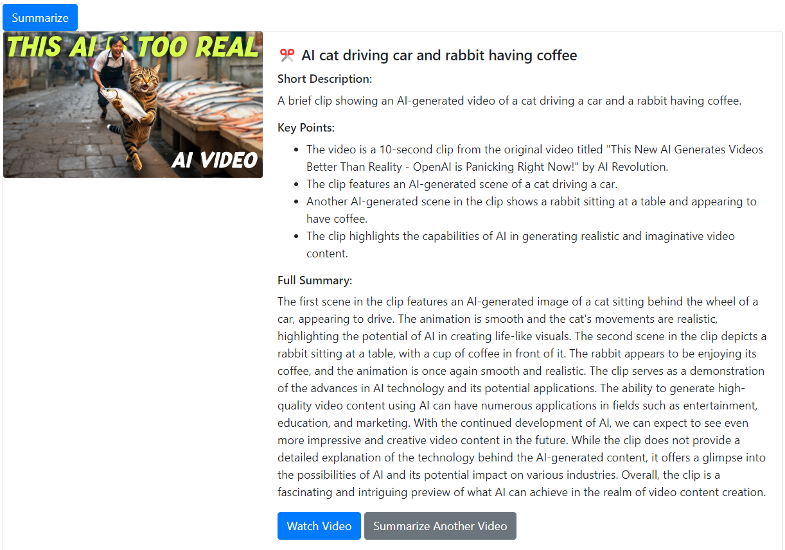

# YouTube Summarizer 🎥📝

YouTube Summarizer is a web application that leverages AI to generate concise summaries of YouTube videos. It enables users to quickly grasp the content of videos without watching them in their entirety.

## Features 🌟

- Summarize individual YouTube videos
- Search for videos and get summaries of multiple results
- User authentication and profile management
- History tracking of summarized videos and searches

## Tech Stack 💻

- Django
- React.js
- Python
- JavaScript
- HTML/CSS
- Bootstrap
- SQLite
- Selenium WebDriver

## Output Screenshots 📸

### Search Results Page


The search results page displays:

- Thumbnails of videos
- Video titles
- Short descriptions
- Key points
- Options to show/hide full summaries
- Links to watch the full videos

### Individual Video Summary



The individual video summary page shows:

- Video thumbnail
- Title
- Short description
- Key points
- Full summary
- Option to watch the video

## Installation 🛠️

1. Clone the repository:

   ```bash
   git clone https://github.com/yourusername/youtube-summarizer.git
   ```

2. Navigate to the project directory:

   ```bash
   cd youtube-summarizer
   ```

3. Create a virtual environment:

   ```bash
   python -m venv venv
   ```

4. Activate the virtual environment:
   - On Windows:

     ```bash
     venv\Scripts\activate
     ```

   - On macOS and Linux:

     ```bash
     source venv/bin/activate
     ```

5. Install the required packages:

   ```bash
   pip install -r requirements.txt
   ```

6. Set up the database:

   ```bash
   python manage.py migrate
   ```

7. Create a superuser:

   ```bash
   python manage.py createsuperuser
   ```

## Usage 🚀

1. Start the development server:

   ```bash
   python manage.py runserver
   ```

2. Open a web browser and navigate to `http://localhost:8000`

3. Log in or create an account

4. Enter a YouTube video URL or search query to get summaries

## Contributing 🤝

We welcome contributions to the YouTube Summarizer project! Here's how you can contribute:

1. Fork the repository
2. Create a new branch (`git checkout -b feature/AmazingFeature`)
3. Make your changes
4. Commit your changes (`git commit -m 'Add some AmazingFeature'`)
5. Push to the branch (`git push origin feature/AmazingFeature`)
6. Open a Pull Request

## License 📄

This project is licensed under the MIT License - see the [LICENSE](LICENSE) file for details.

## Acknowledgments 👏

- Thanks to the Django and React.js communities for their excellent documentation and resources.
- Special thanks to all contributors who have helped to improve this project.

---

Thank you for using the YouTube AI Summary App! 🎉
